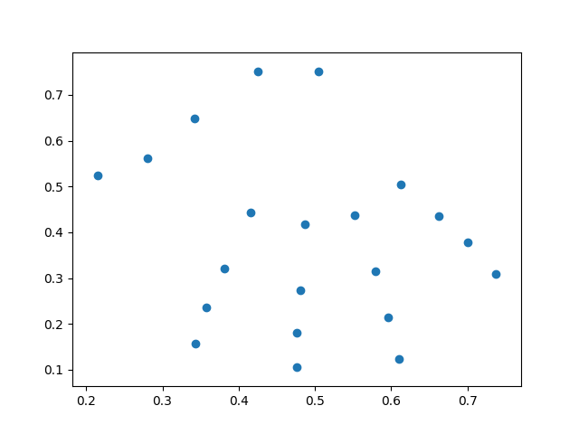

# Gesture Recognition with Mediapipe
Training machine learning model for gesture recognition with [Mediapipe Framework](https://github.com/google/mediapipe/) and K-Nearest Neighbors ([K-Neighbors Classifier](https://scikit-learn.org/stable/modules/generated/sklearn.neighbors.KNeighborsClassifier.html)) algorithm.

## Introduction
The purpose of this project is to explore some Machine Learning algorithms along with the Google Mediapipe framework.
  
The "Hand Tracking" feature is used, which consists of recognition of only one hand. The c ++ file located in [here](mediapipe/demo_run_graph_main_out.cc), has been changed to instead return a new mp4 video with Mediapipe on, it will return a .csv file that contains the coordinates of the landmarks. In total there will be 21 landmarks, as they are distributed by hand in full.
Standard Media Pipe output :
 
Modified MediaPipe output in a plot:


## Preparing environment
To be able to initialize this project, it is necessary to have some settings configured on your machine.
1. Download and install Python version 3.7+ and the Pip package manager. Follow the instructions (according to your operating system) on the [official website](https://www.python.org/downloads/) of the distributor.
2. Create a Python [virtual environment](https://virtualenv.pypa.io/en/stable/) for the project using Virtualenv. This will cause project dependencies to be isolated from your Operating System. Once you create the python environment, enable it before proceeding to the next steps. Ex: You should see `(env)your-user-name:$` in the terminal.
4. Run `$ pip install -r requirements.txt` to install dependencies.

### Mediapipe Framework
1. Clone [Mediapipe](https://github.com/google/mediapipe/) repository;
2. Install mediapipe as explained [here](https://github.com/google/mediapipe/blob/master/mediapipe/docs/install.md);
3. Copy **mediapipe** (**~/mediapipe/mediapipe/**) folder to **~/training-mediapipe-model/mediapipe/**;

### Datasets
For the models to be able to classify the gesture, it is necessary to have at least two classes, that is, two datasets with different gestures and containing mp4 video files.

## Running
### Pre-process
The input data for the model is the coordinates of the landmarks provided by Mediapipe. It is necessary to start this preprocessing in order to obtain this data. You will need to do this step for all datasets:
1. At **~/training-mediapipe-model/** run with the first parameter being to indicate the path to your dataset and the second to classify this dataset:
```
$ python src/preprocess.py --input_dataset_path /path/to/dataset/ --classification NameOfTheLabel
```
### Build
 To train the model, we need all csv's of all classifications in just one file. So this is what the **build** file does.
 1. At **~/training-mediapipe-model/** run with the first parameter (separated by commas) to indicate which datasets will be served to the model:
 ```
$ python src/build.py --datasets_compile "dataset01,dataset02,dataset003"
```

### Using with the Mediapipe-API
TODO: [Mediapipe-API](https://github.com/samborba/mediapipe-api/)

## Reference
1. [Mediapipe](https://github.com/google/mediapipe/);
2. [Scikit-Learn Documentation](https://scikit-learn.org/stable/modules/generated/sklearn.neighbors.KNeighborsClassifier.html);
3. [Sentdex](https://www.youtube.com/user/sentdex/featured);